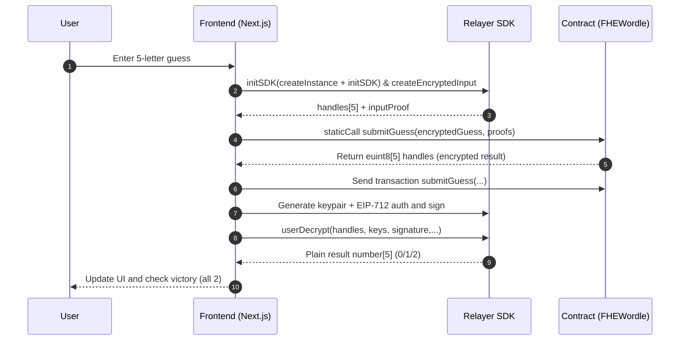

# Onchain FHE Wordle

A Web3 Wordle example project that includes smart contracts (Hardhat) and a frontend (Next.js). It integrates Zama FHE for privacy-preserving word guessing and also provides an ERC1155 NFT (DailyPuzzleSolvedNFT) to prove solving the daily puzzle.

> Try live demo: https://onchain-fhe-wordle.vercel.app/

## Directory Structure

```text
├── .gitignore                          # Git ignore rules
├── LICENSE                             # License (MIT)
├── README.md                           # Project documentation
└── packages\                           # Monorepo packages
    ├── hardhat\                        # Smart contracts package
    │   ├── .env                        # Deployment/network env vars (local, private)
    │   ├── .env.example                # Example env vars
    │   ├── .eslintignore
    │   ├── .eslintrc.json
    │   ├── .prettierrc.json
    │   ├── .solhint.json               # Solidity Lint config
    │   ├── artifacts\                 # Build artifacts
    │   ├── cache\                     # Build cache
    │   ├── contracts\                 # Contract sources
    │   │   ├── FHEWordle.sol           # Main FHE Wordle contract
    │   │   └── DailyPuzzleNFT.sol      # Daily puzzle NFT (ERC1155)
    │   ├── deploy\                    # Deployment scripts
    │   │   └── deploy.ts               # hardhat-deploy entry script
    │   ├── deployments\               # Deployment records (addresses/ABIs)
    │   │   └── sepolia\               # Sepolia network
    │   │       ├── .chainId            # Cached chain ID
    │   │       ├── FHEWordle.json      # FHEWordle deployment info
    │   │       ├── DailyPuzzleNFT.json # DailyPuzzleNFT deployment info
    │   │       └── solcInputs\        # Cached compilation inputs
    │   ├── hardhat.config.ts           # Hardhat config
    │   ├── package-lock.json
    │   ├── package.json
    │   └── tsconfig.json               # TypeScript config
    └── nextjs\                         # Frontend application package
        ├── .env.local                  # Frontend env vars (contract addresses/chain ID)
        ├── .eslintignore
        ├── .eslintrc.json
        ├── .prettierignore
        ├── .prettierrc.json
        ├── app\                        # App Router
        │   ├── globals.css             # Global styles
        │   ├── layout.tsx              # Root layout
        │   └── page.tsx                # Homepage
        ├── components\                 # Components
        │   └── WordleGame.tsx          # Main game component
        ├── contracts\                  # ABI files
        │   ├── FHEWordle.json          # FHEWordle ABI
        │   └── DailyPuzzleNFT.json     # DailyPuzzleNFT ABI
        ├── hooks\                      # React Hooks
        │   ├── useRelayerFHE.ts        # FHE encryption/decryption and submission
        │   └── useWallet.ts            # Wallet connection/network switching
        ├── next-env.d.ts               # Next.js type declarations
        ├── next.config.js              # Next.js config
        ├── package-lock.json
        ├── package.json
        ├── postcss.config.js           # PostCSS config
        ├── tailwind.config.js          # Tailwind config
        ├── tsconfig.json               # TypeScript config
        ├── types\                      # Type declarations
        │   └── global.d.ts             # Global type declarations
        └── utils\                      # Utility functions
            └── networks.ts             # Supported networks/switch params
```

## Requirements

- Node.js 18+ (recommend 18 or 20)
- npm 9+ (or pnpm/yarn; adjust commands accordingly)

## Installation and Running

### 1) Install dependencies

- Hardhat package:
  
  ```bash
  cd packages/hardhat
  npm install
  ```

- Next.js package:
  
  ```bash
  cd packages/nextjs
  npm install
  ```

### 2) Development and Build

- Frontend development:
  
  ```bash
  cd packages/nextjs
  npm run dev
  # Visit http://localhost:3000/ in the browser
  ```

- Frontend build (type-check + production build):
  
  ```bash
  cd packages/nextjs
  npm run build
  ```

- Contract compilation:
  
  ```bash
  cd packages/hardhat
  npx hardhat compile
  ```

- Contract lint (Solhint / Prettier):
  
  ```bash
  cd packages/hardhat
  npm run lint
  ```

## Environment Variables

- packages/nextjs/.env.local
  
  - Required:
    - NEXT_PUBLIC_CONTRACT_ADDRESS: FHEWordle contract address (must match the wallet’s network).
    - NEXT_PUBLIC_WALLETCONNECT_PROJECT_ID: WalletConnect project ID (required to enable WalletConnect QR login).
  - Optional:
    - NEXT_PUBLIC_NFT_ADDRESS: DailyPuzzleNFT address (leave empty to skip daily NFT checks).
    - NEXT_PUBLIC_CHAIN_ID: Preferred chain ID (auto-detect if not set).
    - NEXT_PUBLIC_RPC_URL: RPC URL used by WalletConnect for the target chain (improves reliability on testnets, e.g. https://rpc.sepolia.org).
    - NEXT_PUBLIC_RELAYER_RPC_URL: RPC URL used by Relayer SDK host-chain calls.
    - NEXT_PUBLIC_RELAYER_URL: Relayer service base URL (overrides default in SepoliaConfig).
  - Behavior:
    - If NEXT_PUBLIC_WALLETCONNECT_PROJECT_ID is missing, the Connect Wallet button shows an error and WalletConnect login is disabled. Injected wallets are not wired by default in `hooks/useWallet.ts`.

- packages/hardhat/.env
  
  - For deployment or interacting with public networks, configure:
    - PRIVATE_KEY: Private key of the deployment account (keep it secret).
    - INFURA_API_KEY: Infura project ID (or use another RPC).
    - ETHERSCAN_API_KEY: For contract verification (optional).

> Note: Do not commit any private keys or sensitive information to the repository.

## Backend-Frontend Sync (Deployment → Frontend)

- In `packages/hardhat/deploy/deploy.ts`, use hardhat-deploy to deploy contracts to the target network and:
  
  - Write/sync the latest addresses into the frontend `.env.local` (CONTRACT and NFT).
  - Sync ABIs to `packages/nextjs/contracts/*.json` to ensure frontend and on-chain contract ABIs are consistent.

- Common commands:
  
  ```bash
  # Local network deployment (start a local node first)
  cd packages/hardhat
  npm run deploy:localhost
  
  # Sepolia testnet deployment (requires .env configured)
  cd packages/hardhat
  npm run deploy:sepolia
  ```
  
  After successful deployment, the frontend can directly use the addresses in `.env.local` and the ABIs in `contracts/*.json` to interact.

## Frontend Interaction Guide

- Component `components/WordleGame.tsx`:
  
  - Load ABIs from `contracts/FHEWordle.json` and `contracts/DailyPuzzleNFT.json`.
  - Read `NEXT_PUBLIC_CONTRACT_ADDRESS` and `NEXT_PUBLIC_NFT_ADDRESS` environment variables.
  - Use `ethers.Contract` and `BrowserProvider` to sign and call transactions.
  - On load, verify the address is deployed on the current network (`provider.getCode(address)`) to avoid misuse.
  - Game interaction (encrypting guesses, on-chain verification, result decryption) is integrated via `hooks/useRelayerFHE.ts` with FHEVM.

- Wallet control `hooks/useWallet.ts`:
  
  - Detect connection status, current account, and chain ID (`eth_accounts`, `eth_chainId`).
  - Support connecting the wallet (`eth_requestAccounts`).
  - Support switching networks (`wallet_switchEthereumChain`) and auto-adding if missing (`wallet_addEthereumChain`).
  - Automatically listen to `accountsChanged` and `chainChanged` and refresh state.

- Network params `utils/networks.ts`:
  
  - Sepolia supported by default (chain ID 11155111). Use `getNetworkSwitchParams` to generate MetaMask switch params.

## FHE Encryption/Decryption Flow

- Encryption (Frontend → Relayer SDK):
  
  - Initialize SDK: dynamically import `@zama-fhe/relayer-sdk/web` in the browser.
  - Build encrypted input: create a one-time `createEncryptedInput(dappAddr, userAddr)` and append each of the 5 letters using `add8(ascii)` or `add('externalEuint8', ascii)`.
  - Produce ciphertext: call `encrypt()` to obtain `handles` (each is a 32-byte handle) and a single `inputProof`. The frontend converts `handles` to `bytes32[5]` (`encryptedGuess`) and reuses `inputProof` to produce `bytes[5]` (`proofs`).

- On-chain verification (Contract FHEWordle):
  
  - First call `submitGuess(encryptedGuess, proofs)` via `staticCall` to get the encrypted result handles `(euint8[5])`.
  - Then send a real transaction `submitGuess(...)`. The chain compares using FHE operations and returns encrypted result handles (0/1/2 meaning gray/yellow/green).

- Decryption (User → Relayer SDK):
  
  - Generate a one-time keypair (ML-KEM) and construct an EIP-712 authorization message, then sign via the user's wallet `signTypedData`.
  - Call `userDecrypt(pairs, privateKey, publicKey, signature, [dappAddr], userAddr, startTs, days)` to obtain plaintext results, map back to the input order to form `number[]` (length 5).

- UI Update:
  
  - Result is `number[]`, where each position 0/1/2 corresponds to gray/yellow/green. The frontend updates the keyboard and board and checks for the win condition (all 2).



## Script Overview

- packages/hardhat
  
  - `npx hardhat compile` Compile contracts
  - `npm run lint` Solhint + Prettier check
  - `npm run deploy:localhost` Local deployment (hardhat-deploy)
  - `npm run deploy:sepolia` Sepolia deployment (hardhat-deploy)

- packages/nextjs
  
  - `npm run dev` Start local dev server
  - `npm run build` Production build (with type-check)
  - `npm run lint` ESLint check
  - `npm run prettier:check` Format check
  - `npm run prettier:write` Auto-fix formatting

## Local Demo

1. In `packages/hardhat`, compile and optionally deploy to local/testnet:
   
   ```bash
   cd packages/hardhat
   npx hardhat compile
   # Or use the deploy scripts above to deploy to Sepolia
   ```
2. Fill deployed contract addresses into `packages/nextjs/.env.local`:
   
   ```env
   NEXT_PUBLIC_CONTRACT_ADDRESS=0x...
   NEXT_PUBLIC_NFT_ADDRESS=0x...
   ```
3. Start the frontend:
   
   ```bash
   cd packages/nextjs
   npm run dev
   ```
4. Open `http://localhost:3000/` in the browser, click Connect Wallet, ensure the network and addresses match, then try the Wordle game.

## License

This project uses the MIT License. See the `LICENSE` file in the repository root for details.
